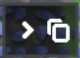

# ⚡ Quick Access Schematics (QuickSchema)

A Mindustry Java mod that introduces a customizable, floating **Quick Access HUD Bar** for fast favorite schematics selection on both **PC** and **Mobile**!

---

## 🌟 Key Features

- ⚡ **Instant Placement**: Single-tap/click any schematic on the HUD bar to immediately equip it for building.
- 📑 **Dynamic Expansion (1 to 36 Slots)**: The HUD bar automatically extends from 1 to 36 slots as you add schematics.
- 🔄 **Non-Overlapping Position Switcher**: One-tap reposition button to switch between:
  1. **Top-Right (Under Minimap)** *(Default)*
  2. **Left-Center**
  3. **Bottom-Left (Elevated above unit controls)**
- 🎨 **Native Mindustry Schematics Picker**: Full-screen grid picker with high-res schematic preview rendering (`Vars.schematics.getPreview(s)`).
- 🛑 **Duplicate Prevention & Warning**: Prevents adding duplicate slots and alerts you if a schematic is already saved in another slot.
- 📱 **Mobile & PC Friendly**: Includes a fold/unfold collapse button to keep mobile screens completely clutter-free when not building.
- 🗑️ **Clear All Support**: Easily empty all saved quick slots at once with confirmation.

---

## 📖 Player Guide

### ➕ How to Add Schematics to Quick Access:
1. **Method 1 (From Clipboard)**: Copy/hold any schematic and tap the `⭐` button on the HUD bar or click "Assign Held".
2. **Method 2 (From Library)**: Tap an empty `[+]` slot to open the searchable visual schematics picker.
3. **Method 3 (From Native Schematics Dialog)**: Open Mindustry's standard schematics menu and click the **"⭐ Quick Access"** button at the bottom.

### 🎮 Controls:
- **Left-Click / Single Tap**: Equip schematic for building.
- **Right-Click / Long-Press**: Open slot context menu (Select, Replace, or Remove).
- **Collapse Button (`<` / `>`)**: Toggle bar visibility on HUD.
- **Refresh Button (`🔄`)**: Cycle bar position on screen.

---

## 🛠️ Building & Installation

### Building for Desktop Testing
1. Ensure JDK **17** is installed.
2. Run `./gradlew jar`.
3. The generated jar file will be located at `build/libs/QuickSchemaDesktop.jar`.

### Building Multiplatform JAR (Android & Desktop)
1. Ensure `ANDROID_HOME` is configured.
2. Run `./gradlew deploy` or build via GitHub Actions.
